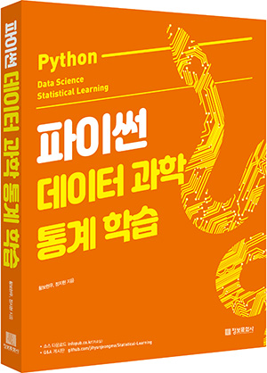

# 파이썬 데이터 과학 통계 학습

<h1 align="center">
   
  
   
  
   
</h1>

# 책 소개

# 저자

# 구매처

# 목차

## PART 01. 데이터 과학을 위한 체계

## PART 02. 데이터 과학을 위한 파이썬

## PART 03. 회귀

## PART 04. 분류

## PART 05. 그룹화

## PART 06. 차원축소